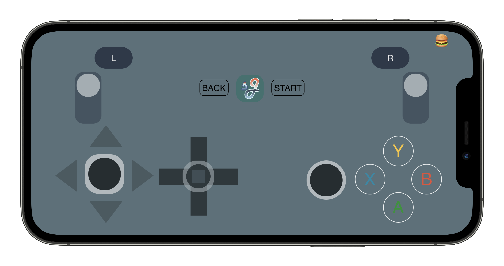

Use your smartphone as a virtual xbox controller for your PC!




Checkout the frontend demo [here](https://gamepad.harshgupta.dev)

(<sub><sup>It is recommended you open this demo on a mobile device</sup></sub>)

## Quickstart

Download one of the pre-built binaries for your desired platform from [releases](https://github.com/harsh2204/socketjoy/releases/) and simply execute the binary to get the server up and running.

To the run the server in debug mode, run the executable in a terminal with `-d` flag.

---

### Manual Setup (Windows & Linux)

Clone the repo
```
git clone https://github.com/harsh2204/socketjoy.git
cd socketjoy/
```

Setup a virtual env and activate it
```
python3 -m venv .venv

# Linux
source .venv/bin/activate 

# Windows
.venv\Scripts\activate.bat
```

Install the python dependencies

```
pip install -r socketjoy/requirements.txt
```

At this point you can try to run the server

```
cd socketjoy/

# Setup
# Note - Higher system privileges are required to setup this program.
python app.py --setup

# Run server
python app.py

# Run python app.py --help for more info 
```

---
### Building the binary file (Optional)

Install pyinstaller
```
pip install pyinstaller
pyinstaller --version
```

**Windows**

Note - You may need to install Visual Studio Runtime 2015 to build the executable.

```
pyinstaller --noconfirm --clean 
```

The `socketjoy.exe` file will be placed in `dist/`.

**Linux**

**!** Install `appimagetool` using your distro's package manager

You can now run `linux_build.sh` to start the build and packaging process.

The AppImage binary will be placed in `dist/socketJoy.AppImage`. This is a portable binary that should work on other machines with the same architecture as your machine.
